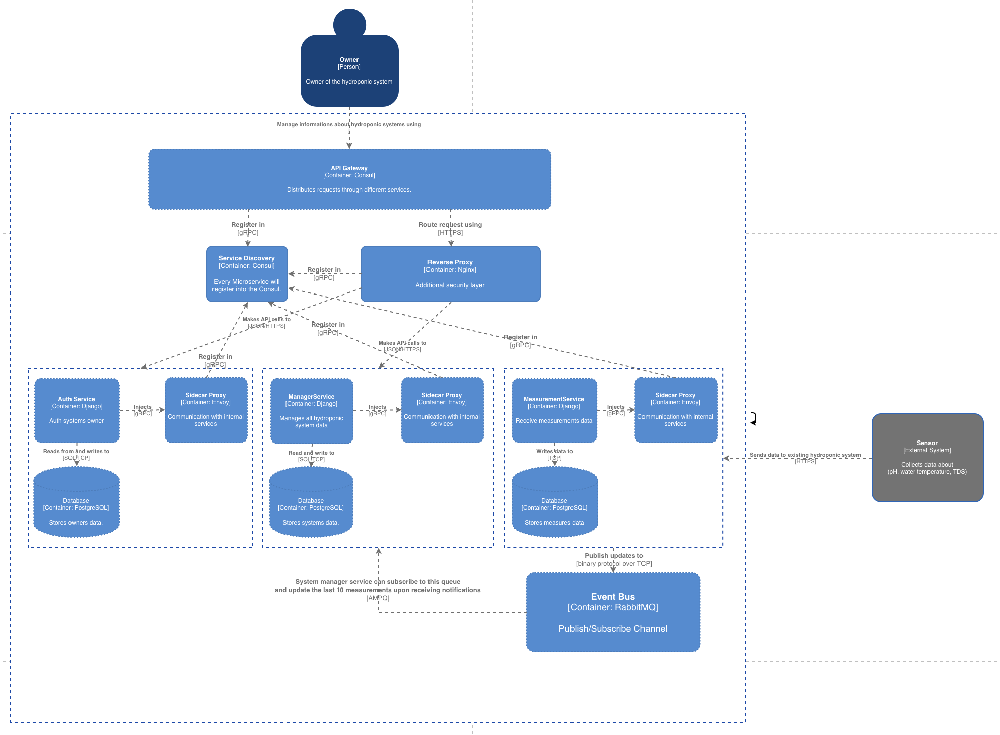

# hydroponic-systems

[](https://youtu.be/DAO_oPXLdBc)

Application facilitate hydroponic system management implemented using microservices made of:
- AuthService
- ManagerService
- MeasurementService

## Features 
### User login endpoint:
- Authentication and authorization system

### Hydroponic system management endpoint:
- CRUD, for information about hydroponic systems
- Each hydroponic system should be assigned to the system owner
- Data validation based on DRF 

### Measurements endpoint:
- Allows to receive data from the sensors and send them to the existing hydroponic system
- Measurements should be saved in the database

### Reading data about systems and measurements:
- User should be able to read list of his hydroponic systems
- Each read data methods should give possibility to filter data (timestamps, values)
- Those methods should also allow to sort results 
- In methods where it will be needed, implement data pagination
- Possibility to get details about certain hydroponic systems with data from last 10 measurements

## Technologies used 
- Application is implemented with microservices architecture
- Application is created with Django using DRF 
- Each service uses PostgreSQL as database, with materialized views and indices 
- For communication with AuthService gRPC is used as it's faster that REST API
- For asynchronous communication between MeasurementService and ManagerService RabbitMQ is used
- Application will use Docker for service conterization and k8s for container management

## Installation

1. Clone the repository:
    ```bash
    git clone https://github.com/opielapatryk/hydroponic-systems
    cd k8s
    ```

2. Make install.sh executable and run deployment:
    ```bash
    chmod +x install.sh
    ./install.sh
    ```

### Connect with API Gateway via:

Auth: *http://127.0.0.1:8000/api/v1/schema/auth* <br> 
System: *http://127.0.0.1:8000/api/v1/schema/system* <br> 
Measurements: *http://127.0.0.1:8000/api/v1/schema/measurement* <br>

## Monitoring tools installation

1. Change dir from k8s to monitoring-tools:
    ```bash
    cd monitoring-tools
    ```

2. Make install-observability-suite.sh executable and run deployment:
    ```bash
    chmod +x install-observability-suite.sh
    ./install-observability-suite.sh
    ```

3. Connect with grafana via:
    ```bash
    kubectl port-forward svc/grafana --namespace default 3000:3000
    ```

and go to:
*http://localhost:3000/d/hydroponic*


## License

This project is licensed under the MIT License.
